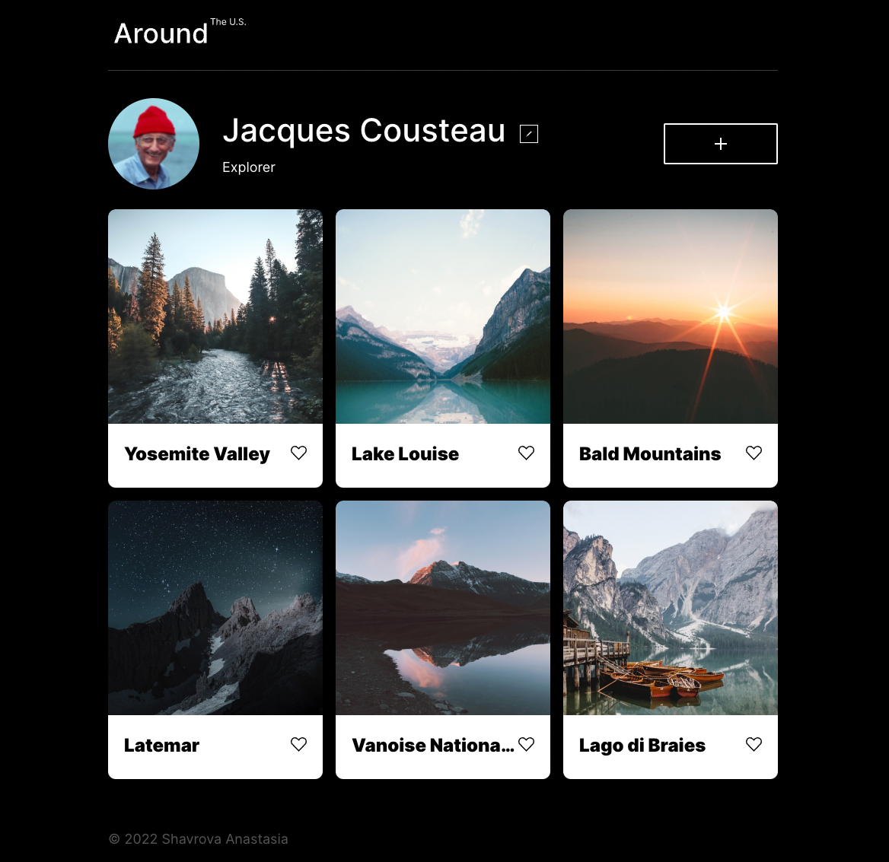

# Project 4: Around The U.S.

## Overview

"Around the U.S." is an interactive page where users can add, remove, or like photos that focus on travel to the United States. All items display correctly on all popular screen sizes. And at this point, a form has been added to change the username and description.

### GitHub page's link**  
* ["Practicum Art Gallery"](https://meleana.github.io/web_project_3/) 

#### Project technologies
* HTML 
* CSS including Flex and Grid layouts and @mediascreen properties for several screen resolutions
* JS
* Figma design tools
* Flat BEM file structure

**Design files**
* [Link to the project in Figma](https://www.figma.com/file/SurN1jaeEQIhuZEDMhmWWf/Sprint-4-Around-The-U.S.-desktop-mobile?node-id=0%3A1)

#### Plan on improving the project

- Design discussion. Error correction/redesign/elimination of visual inaccuracies
- Adding content
- Improve photo quality depending on the device (screen size)
- Adaptation/reduction of code
- Connecting the ability to add, delete and edit photos. 
- Adding validation to all forms
- Create a mobile application
- Remote server connection
- Sending and receiving data from the server
- Adding a likes counter
- Ability to change profile avatar
- Adding animation to forms and user actions